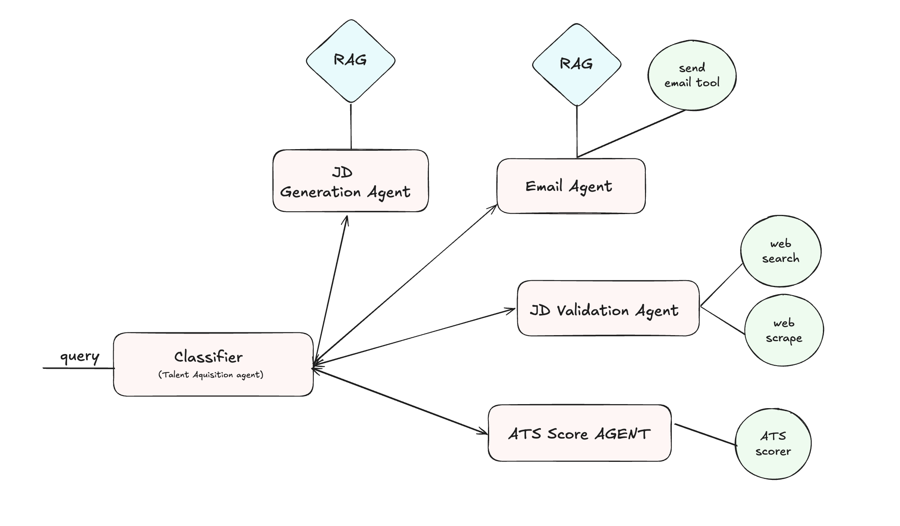
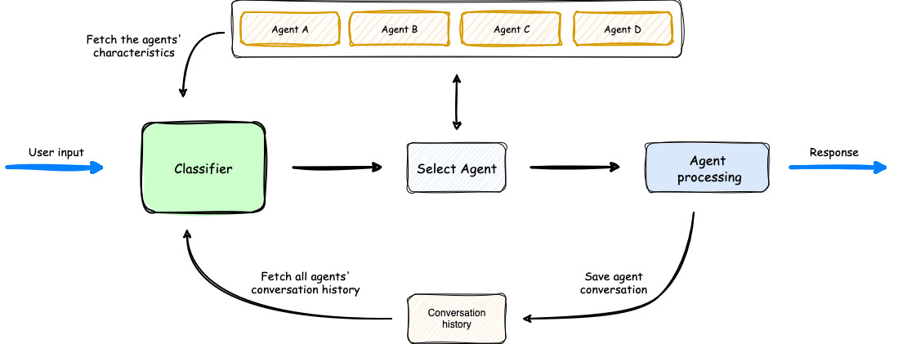

# AI-Driven Talent Acquisition and Onboarding Assistant API

An AI-powered assistant designed to streamline talent acquisition and employee onboarding by automating job posting, candidate evaluation, personalized onboarding materials, and dynamic guidance. This API leverages modern web scraping, Retrieval-Augmented Generation (RAG), dynamic prompting, and semantic search techniques to improve recruitment efficiency and accelerate the onboarding process.

---

## Table of Contents

- [AI-Driven Talent Acquisition and Onboarding Assistant API](#ai-driven-talent-acquisition-and-onboarding-assistant-api)
  - [Table of Contents](#table-of-contents)
  - [Features](#features)
    - [Talent Acquisition Support](#talent-acquisition-support)
    - [Employee Training and Onboarding](#employee-training-and-onboarding)
  - [Architecture Overview](#architecture-overview)
  - [Technologies Used](#technologies-used)
  - [Summary of Research Papers](#summary-of-research-papers)
    - [1. Adaptive-RAG: Learning to Adapt Retrieval-Augmented Large Language Models through Question Complexity](#1-adaptive-rag-learning-to-adapt-retrieval-augmented-large-language-models-through-question-complexity)
    - [2. Corrective Retrieval Augmented Generation](#2-corrective-retrieval-augmented-generation)
    - [3. Self-RAG: Learning to Retrieve, Generate, and Critique through Self-Reflection](#3-self-rag-learning-to-retrieve-generate-and-critique-through-self-reflection)
    - [4. ReAct: Synergizing Reasoning and Acting in Language Models](#4-react-synergizing-reasoning-and-acting-in-language-models)
    - [5. The Landscape of Emerging AI Agent Architectures for Reasoning, Planning, and Tool Calling: A Survey](#5-the-landscape-of-emerging-ai-agent-architectures-for-reasoning-planning-and-tool-calling-a-survey)
  - [Development](#development)
    - [Running in Development Mode](#running-in-development-mode)
    - [Testing](#testing)

---

## Features

### Talent Acquisition Support
- **Job Description Generation:** Automatically generate job descriptions and post listings across multiple platforms based on initial requirements.
- **Job Description Validation:** Validate job descriptions for alignment with required technologies and skills.
- **Candidate Scoring:** Score candidates by matching their resumes with job requirements.
- **Automated Communication:** Send email notifications to rejected candidates and schedule interviews for selected candidates.

### Employee Training and Onboarding
- **Personalized Onboarding Materials:** Retrieve tailored onboarding documents, FAQs, and internal resources using Retrieval-Augmented Generation (RAG).
- **Dynamic Prompts:** Provide real-time, context-aware guidance tailored to employee roles and teams.
- **Follow-Up Interaction:** Generate AI-driven follow-up questions to confirm understanding and guide new hires through training modules.

---

## Architecture Overview

- **Talent Acquisition Agent**

- **Onboarding Assistant**

- **Multi-Agent Orchestration**


---

## Technologies Used

- **Node.js:** JavaScript runtime for building scalable network applications.
- **Express.js:** Fast, unopinionated web framework for Node.js.
- **MongoDB:** NoSQL database for flexible and scalable data storage.
- **Chromadb:** Vector database for semantic embedding and similarity searches.
- **Ollama:** Integration for advanced generative AI capabilities.
- **OpenAI SDK:** For interfacing with OpenAI's language models.
- **RAG (Retrieval-Augmented Generation):** Combines retrieval techniques with generative models for context-aware responses.
- **Tessarct:** Optical text extraction tool for processing non-digital text formats.
- **NLP Sentensize:** For sentence segmentation and advanced text analysis.

---

## Summary of Research Papers

Below are brief summaries for each paper implemented in the Project:

---

### 1. Adaptive-RAG: Learning to Adapt Retrieval-Augmented Large Language Models through Question Complexity
**Link:** [arXiv:2403.14403](https://arxiv.org/abs/2403.14403)
- **Adaptive Strategy:** Proposes a framework that dynamically selects the most suitable retrieval strategy based on the complexity of the user’s question.
- **Complexity Classifier:** Uses a lightweight classifier trained on automatically obtained labels to predict query complexity.
- **Flexible Retrieval:** Seamlessly adapts between no-retrieval, single-step retrieval, and iterative retrieval methods, thereby balancing efficiency and accuracy in QA systems.

---

### 2. Corrective Retrieval Augmented Generation
**Link:** [arXiv:2401.15884](https://arxiv.org/abs/2401.15884)
- **Robust Generation:** Addresses hallucinations in large language models by assessing the relevance of retrieved documents before generation.
- **Retrieval Evaluator:** Introduces a lightweight evaluator that returns a confidence score, triggering alternative retrieval actions when needed.
- **Web Search Augmentation:** Extends static corpora retrieval with large-scale web searches and uses a decompose-then-recompose algorithm to focus on key information, thereby enhancing output robustness.

---

### 3. Self-RAG: Learning to Retrieve, Generate, and Critique through Self-Reflection
**Link:** [arXiv:2310.11511](https://arxiv.org/abs/2310.11511)
- **Self-Reflection Mechanism:** Introduces reflection tokens that allow the model to critique and adjust its own outputs during generation.
- **Adaptive Retrieval:** The model learns to retrieve passages on-demand and uses its self-generated critiques to refine answers, improving factuality.
- **Enhanced Performance:** Demonstrates significant gains over traditional RAG approaches on tasks such as open-domain QA, reasoning, and fact verification.

---

### 4. ReAct: Synergizing Reasoning and Acting in Language Models
**Link:** [arXiv:2210.03629](https://arxiv.org/abs/2210.03629)
- **Interleaved Reasoning and Acting:** Proposes a framework where the model alternates between generating reasoning traces and executing actions.
- **Tool Integration:** Leverages external tools (e.g., a Wikipedia API) to fetch information on demand, reducing hallucinations and enhancing task performance.
- **Improved Interpretability:** The interleaved process not only leads to better task outcomes but also makes the decision-making process more transparent to users.

---

### 5. The Landscape of Emerging AI Agent Architectures for Reasoning, Planning, and Tool Calling: A Survey
**Link:** [arXiv:2404.11584](https://arxiv.org/pdf/2404.11584)
- **Comprehensive Survey:** Reviews recent advancements in AI agent architectures, focusing on how they enable complex tasks through enhanced reasoning, planning, and tool execution.
- **Single vs. Multi-Agent Systems:** Discusses both single-agent and multi-agent designs, highlighting trade-offs in terms of division of labor, leadership structures, and communication strategies.
- **Key Themes:** Outlines essential components such as agent personas, effective tool calling, dynamic team construction, and the integration of planning and self-reflection to robustly accomplish end-to-end tasks.

---

## Development

### Running in Development Mode
For live reloading during development, use:
```bash
npm run dev
```

### Testing
Run the automated test suite with:
```bash
npm test
```
